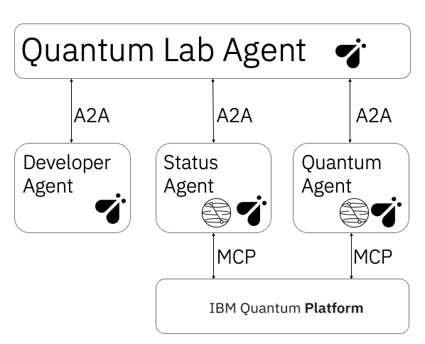

<div align="center">

# ⚛️ Quantum Lab Agent

### The main orchestrator for the Quantum Computing Multi-Agent System

[](https://www.python.org/)
[](https://www.ibm.com/granite)
[](https://github.com/a2aproject/A2A)
[](https://quantum.ibm.com/)

Route natural-language requests across specialized agents for quantum code generation,
job monitoring, and circuit execution on simulators or real IBM Quantum hardware.

[Quick start](#-quick-start) · [Architecture](#-architecture) · [API example](#-api-example) · [Related repositories](#-related-repositories)

</div>

---

## Overview

The Quantum Lab Agent is the system's single entry point. It listens on port `8000`, determines which capability a request needs, coordinates the appropriate specialized agents through A2A, and returns one combined response.

The default local language model is **IBM Granite 4 Small H**, served by Ollama as `ollama:granite4:small-h`.

> [!IMPORTANT]
> Full functionality requires all three specialized agents to be running alongside the Lab Agent.

| Service | Responsibility | Port | Repository |
|---|---|:---:|---|
| **Quantum Lab Agent** | Main orchestrator | `8000` | This repository |
| **Quantum Developer Agent** | Code generation specialist | `8001` | [View repository](https://github.com/BrUn3y/quantum-developer-agent) |
| **Quantum Status Agent** | Status monitoring specialist | `8002` | [View repository](https://github.com/BrUn3y/quantum-status-agent) |
| **Quantum Computing Agent** | Execution specialist | `8003` | [View repository](https://github.com/BrUn3y/quantum-computing-agent) |

## 🏗️ Architecture

<p align="center">
  
</p>

```text
User request → Lab Agent → Specialized agent(s) → IBM Quantum → Unified response
```

The agents communicate using the Agent-to-Agent protocol. The Computing and Status agents connect to IBM Quantum through their respective tools.

## ✨ Capabilities

| Capability | What it provides |
|---|---|
| 🎯 **Intelligent routing** | Selects the correct specialized agent for each request |
| 💻 **Code generation** | Produces OpenQASM, Qiskit code, and quantum algorithms |
| ⚡ **Circuit execution** | Submits circuits to simulators or real IBM Quantum hardware |
| 📊 **Status monitoring** | Retrieves backend availability, job state, and measurement results |
| 🔄 **Multi-agent workflows** | Chains dependent tasks such as generate → execute → inspect results |
| 🧠 **Local inference** | Uses Granite 4 Small H through Ollama by default |

## 🚀 Quick start

### Requirements

- Python `3.11+`
- [uv](https://github.com/astral-sh/uv)
- [Ollama](https://ollama.com/) with Granite 4 Small H
- IBM Quantum credentials in the specialized agents that access hardware
- All four repositories cloned as sibling directories

### 1. Install the local model

```bash
ollama pull granite4:small-h
```

### 2. Clone and configure the Lab Agent

```bash
git clone https://github.com/BrUn3y/quantum-lab-agent.git
cd quantum-lab-agent
cp .env.example .env
uv sync
```

Default configuration:

```dotenv
OLLAMA_API_BASE=http://127.0.0.1:11434
LAB_MODEL=ollama:granite4:small-h
OPERATIONS_HOST=127.0.0.1
OPERATIONS_PORT=8000

DEVELOPER_HOST=127.0.0.1
DEVELOPER_PORT=8001
STATUS_HOST=127.0.0.1
STATUS_PORT=8002
COMPUTING_HOST=127.0.0.1
COMPUTING_PORT=8003
```

### 3. Start the complete system

Open four terminals and start the specialized agents before the Lab Agent:

```bash
# Terminal 1 — Developer Agent
cd ../quantum-developer-agent && ./start.sh

# Terminal 2 — Status Agent
cd ../quantum-status-agent && ./start.sh

# Terminal 3 — Computing Agent
cd ../quantum-computing-agent && ./start.sh

# Terminal 4 — Lab Agent
cd ../quantum-lab-agent && ./start.sh
```

### 4. Verify each agent

```bash
curl http://127.0.0.1:8000/.well-known/agent-card.json
curl http://127.0.0.1:8001/.well-known/agent-card.json
curl http://127.0.0.1:8002/.well-known/agent-card.json
curl http://127.0.0.1:8003/.well-known/agent-card.json
```

## 💬 API example

Each agent exposes an A2A JSON-RPC endpoint at `/jsonrpc/`. This request asks the Lab Agent to create and execute a Bell circuit:

```bash
curl -X POST http://127.0.0.1:8000/jsonrpc/ \
  -H "Content-Type: application/json" \
  -d '{
    "jsonrpc": "2.0",
    "id": "bell-demo",
    "method": "message/send",
    "params": {
      "message": {
        "kind": "message",
        "messageId": "11111111-1111-4111-8111-111111111111",
        "role": "user",
        "parts": [{
          "kind": "text",
          "text": "Create a Bell state and execute it once on the least busy real IBM Quantum backend."
        }]
      }
    }
  }'
```

The workflow is handled automatically:

1. The Developer Agent generates and validates the OpenQASM circuit.
2. The Computing Agent selects a backend and submits the circuit.
3. The Lab Agent returns the generated code, backend, and IBM Quantum Job ID.
4. The Status Agent can retrieve the job state and measurement results.

## ⚙️ Configuration

| Variable | Default | Purpose |
|---|---|---|
| `OLLAMA_API_BASE` | `http://127.0.0.1:11434` | Ollama API endpoint |
| `LAB_MODEL` | `ollama:granite4:small-h` | Orchestrator model |
| `OPERATIONS_HOST` | `127.0.0.1` | Lab Agent host |
| `OPERATIONS_PORT` | `8000` | Lab Agent port |
| `DEVELOPER_HOST` / `DEVELOPER_PORT` | `127.0.0.1` / `8001` | Developer Agent endpoint |
| `STATUS_HOST` / `STATUS_PORT` | `127.0.0.1` / `8002` | Status Agent endpoint |
| `COMPUTING_HOST` / `COMPUTING_PORT` | `127.0.0.1` / `8003` | Computing Agent endpoint |

Watsonx variables remain available as an optional fallback; see [`.env.example`](.env.example) for the complete configuration.

## 🔁 Common workflows

| Request | Agents involved |
|---|---|
| “Generate a teleportation circuit” | Developer |
| “Create a Bell state and run it” | Developer → Computing |
| “Which backends are available?” | Status |
| “Check job `…` and show its results” | Status |
| “Execute this OpenQASM circuit” | Computing |

## 🐳 Docker

Build and run the Lab Agent:

```bash
docker build -t quantum-lab-agent .
docker run --env-file .env -p 8000:8000 quantum-lab-agent
```

The three specialized agents must still be reachable using the host and port values configured in `.env`.

## 🧰 Troubleshooting

| Problem | Check |
|---|---|
| A specialized agent cannot be reached | Confirm ports `8001–8003` and the corresponding host variables |
| Ollama connection fails | Run `ollama list` and confirm `granite4:small-h` is installed |
| IBM Quantum authentication fails | Verify the IBM Quantum token in the Computing and Status agents |
| A port is already occupied | Run `lsof -nP -iTCP:<port> -sTCP:LISTEN` |
| The server starts but a workflow is incomplete | Confirm all four agent cards respond before sending the request |

## 📁 Project structure

```text
quantum-lab-agent/
├── docs/images/architecture.png
├── src/quantum_operations_agent/
│   ├── agent.py
│   ├── model_config.py
│   └── tools/
│       ├── quantum_developer_client.py
│       ├── quantum_status_client.py
│       └── quantum_computing_client.py
├── .env.example
├── Dockerfile
├── QUICKSTART.md
├── pyproject.toml
├── start.sh
└── uv.lock
```

## 🔗 Related repositories

| Repository | Role |
|---|---|
| [Quantum Computing Agent](https://github.com/BrUn3y/quantum-computing-agent) | Circuit execution specialist |
| [Quantum Status Agent](https://github.com/BrUn3y/quantum-status-agent) | Status monitoring and job tracking |
| [Quantum Developer Agent](https://github.com/BrUn3y/quantum-developer-agent) | Code generation and algorithm implementation |
| [Quantum Lab Agent](https://github.com/BrUn3y/quantum-lab-agent) | Main orchestrator coordinating all agents |

## Contributing

Issues and pull requests are welcome. When adding a new specialized agent, provide its A2A client, endpoint configuration, documentation, and an end-to-end workflow test.

---

<div align="center">

Built with [BeeAI Framework](https://github.com/i-am-bee/bee-agent-framework), [IBM Granite](https://www.ibm.com/granite), and [IBM Quantum](https://quantum.ibm.com/).

</div>
